# DSO101 Assignment 1 — CI/CD To-Do App
**Student:** Dupchu Wangmo  
**Student ID:** 02230282  
**Module:** DSO101 — Continuous Integration and Continuous Deployment  

## Project Overview

A full-stack To-Do List web application built with:
- **Frontend:** React.js (served via Nginx in Docker)
- **Backend:** Node.js + Express.js (REST API)
- **Database:** PostgreSQL


## Repository Structure

```
todo-app/
├── frontend/
│   ├── src/
│   │   ├── App.js
│   │   └── index.js
│   ├── public/
│   │   └── index.html
│   ├── Dockerfile
│   ├── nginx.conf
│   ├── .env.example
│   ├── .env.production
│   ├── .gitignore
│   └── package.json
├── backend/
│   ├── server.js
│   ├── Dockerfile
│   ├── .env.example
│   ├── .env.production
│   ├── .gitignore
│   └── package.json
├── render.yaml
├── .gitignore
└── README.md
```


## Step 0 — Building the Application Locally

### Prerequisites
- Node.js 18+
- PostgreSQL running locally
- Git

### Backend Setup

1. Navigate to the backend folder and install dependencies:
```bash
cd backend
npm install
```

2. Copy `.env.example` to `.env` and fill in your local DB credentials:
```bash
cp .env.example .env
```

Edit `.env`:
```env
DB_HOST=localhost
DB_USER=postgres
DB_PASSWORD=yourpassword
DB_NAME=tododb
DB_PORT=5432
DB_SSL=false
PORT=5001
```

3. Start the backend:
```bash
npm start
```
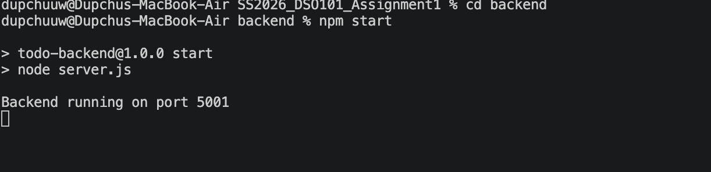

### Frontend Setup

1. Navigate to the frontend folder:
```bash
cd frontend
npm install
```

2. Copy `.env.example` to `.env`:
```bash
cp .env.example .env
```

Edit `.env`:
```env
REACT_APP_API_URL=http://localhost:5001
```

3. Start the frontend:
```bash
npm start
```

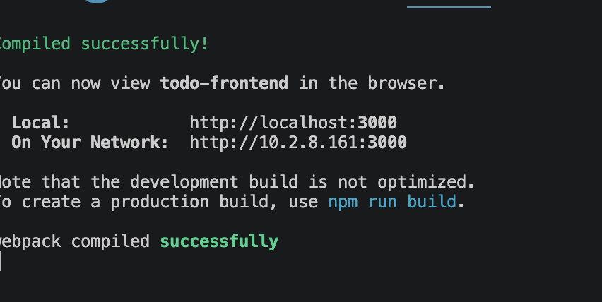

### API Endpoints

| Method | Endpoint | Description |
|--------|----------|-------------|
| GET | `/api/todos` | Get all todos |
| POST | `/api/todos` | Create a new todo |
| PUT | `/api/todos/:id` | Update a todo |
| DELETE | `/api/todos/:id` | Delete a todo |


## Part A — Deploying a Pre-Built Docker Image to Docker Hub

### Step A1 — Build and Push Docker Images

**Backend image:**
```bash
cd backend
docker buildx build --platform linux/amd64 -t dupchuuw/be-todo:02230282 --push .

```
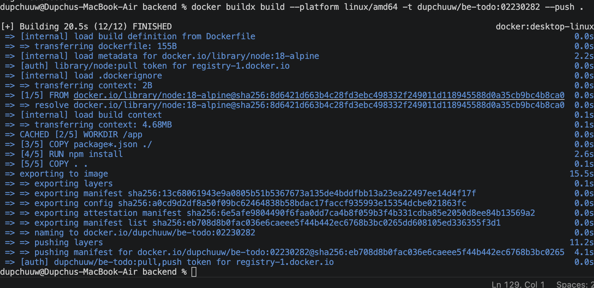

**Frontend image:**
```bash
cd frontend
docker buildx build --platform linux/amd64 -t dupchuuw/fe-todo:02230282 --push .
```

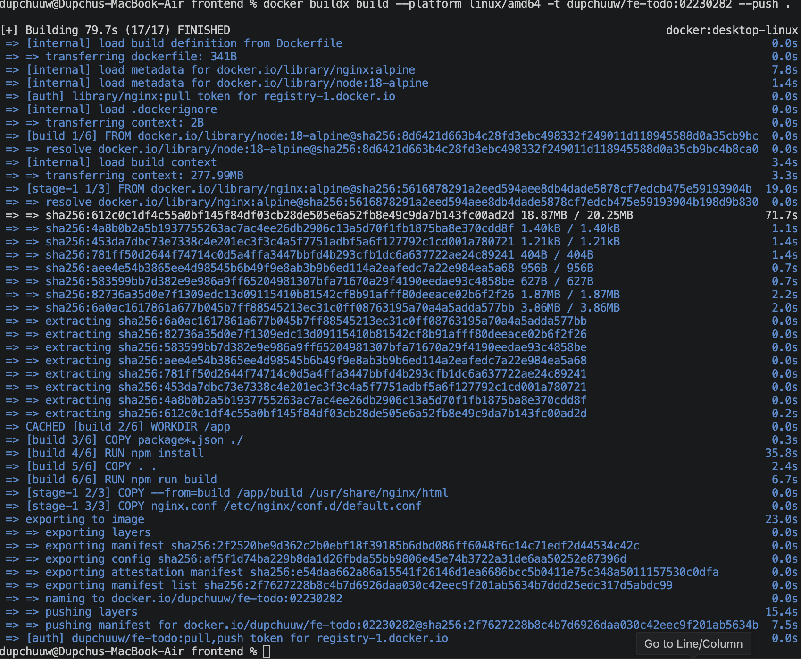

### Step A2 — Deploy on Render.com

#### Database (PostgreSQL)

1. Go to [render.com](https://render.com) → **New** → **PostgreSQL**
2. Name: `todo-db`, Region: Singapore, Plan: Free
3. Click **Create Database**
4. Copy the **Internal Database URL** 

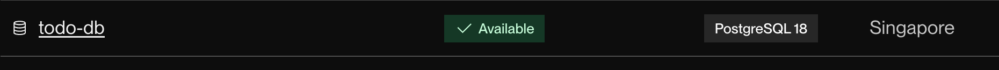

#### Backend Service

1. Go to **New** → **Web Service** → **Deploy an existing image from a registry**
2. Image URL: `docker.io/dupchuuw/be-todo:02230282`
3. Name: `be-todo`, Region: Singapore, Plan: Free
4. Under **Environment Variables**, add:

| Key | Value |
|-----|-------|
| `DB_HOST` | (from Render PostgreSQL Internal Host) |
| `DB_USER` | (from Render PostgreSQL) |
| `DB_PASSWORD` | (from Render PostgreSQL) |
| `DB_NAME` | (from Render PostgreSQL) |
| `DB_PORT` | `5432` |
| `DB_SSL` | `true` |
| `PORT` | `5000` |

5. Click **Create Web Service**

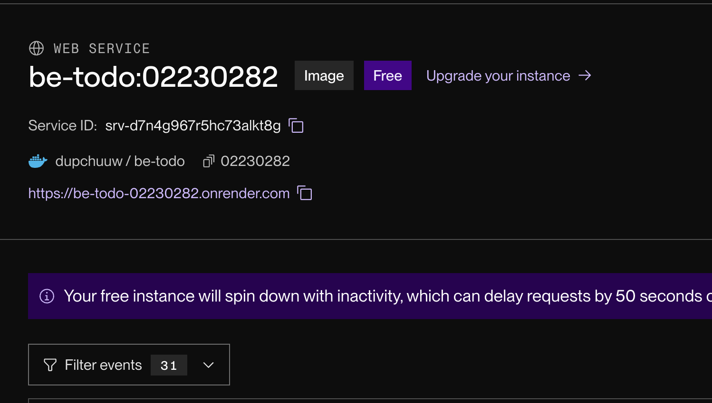

#### Frontend Service

1. Go to **New** → **Web Service** → **Deploy an existing image from a registry**
2. Image URL: `docker.io/dupchuuw/fe-todo:02230282`
3. Name: `fe-todo`, Region: Singapore, Plan: Free
4. Under **Environment Variables**, add:

| Key | Value |
|-----|-------|
| `REACT_APP_API_URL` | `https://be-todo.onrender.com` |

5. Click **Create Web Service**

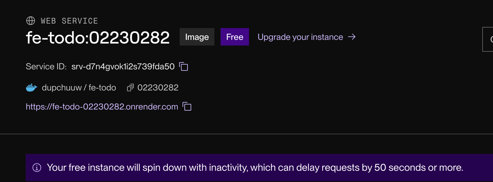


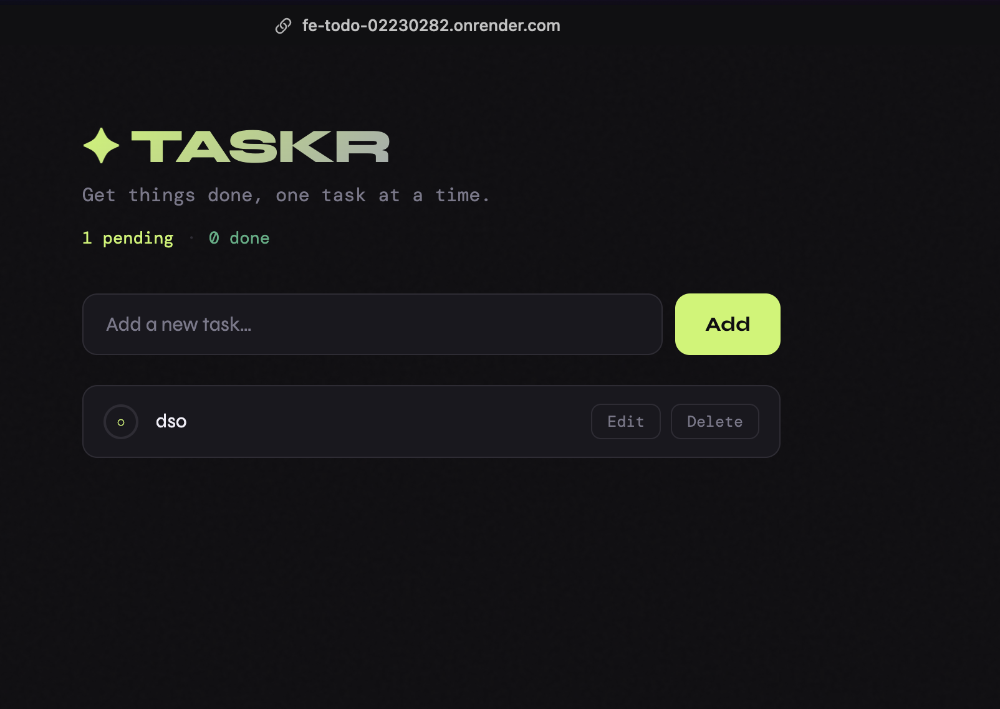

## Part B — Automated Image Build and Deployment (CI/CD)

In this part, Render automatically builds a new Docker image and redeploys whenever a new commit is pushed to GitHub.

### Step B1 — Push Repository to GitHub

```bash
git init
git add .
git commit -m "Initial commit: full-stack todo app"
git branch -M main
git remote add origin https://github.com/Dupchuwangmo7/Dupchuwangmo7_02230282_DSO101_A1.git
git push -u origin main
```
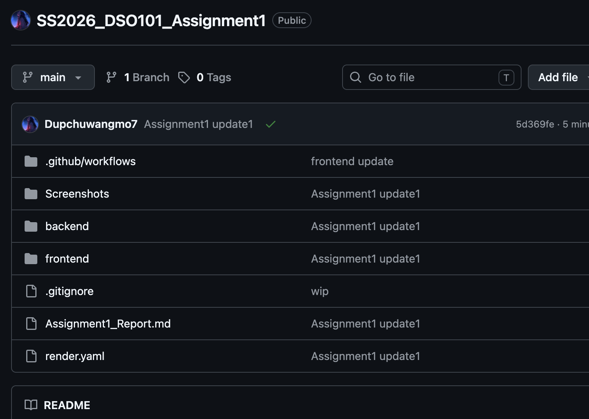


### Step B2 — Connect Render to GitHub via render.yaml (Blueprint)

The `render.yaml` file at the root of the repo configures all three services (frontend, backend, database) automatically.

```yaml
services:
  - type: web
    name: be-todo
    env: docker
    dockerfilePath: ./backend/Dockerfile
    ...
  - type: web
    name: fe-todo
    env: docker
    dockerfilePath: ./frontend/Dockerfile
    ...
```

1. Go to [render.com](https://render.com) → **New** → **Blueprint**
2. Connect your GitHub account and select the repository `Dupchuwangmo7_02230282_DSO101_A1`
3. Render detects `render.yaml` automatically
4. Fill in secret environment variables (DB credentials) when prompted
5. Click **Apply** — Render will create and deploy all services


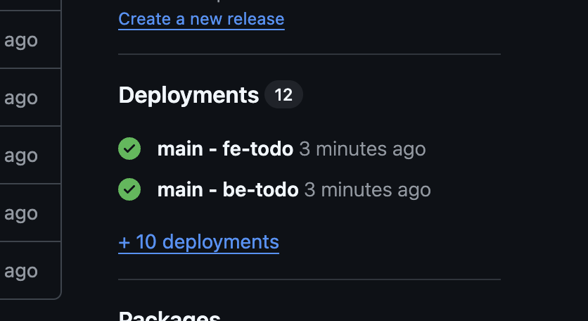

### Step B3 — Verify Auto-Deploy on Git Push
Go to the Render dashboard — you will see a new deployment automatically triggered

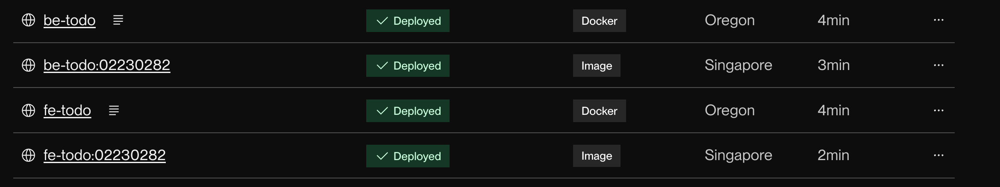


## Live URLs

| Service | URL |
|---------|-----|
| Frontend | `https://fe-todo-02230282.onrender.com` |
| Blueprint | `https://fe-todo-kdkq.onrender.com` |


