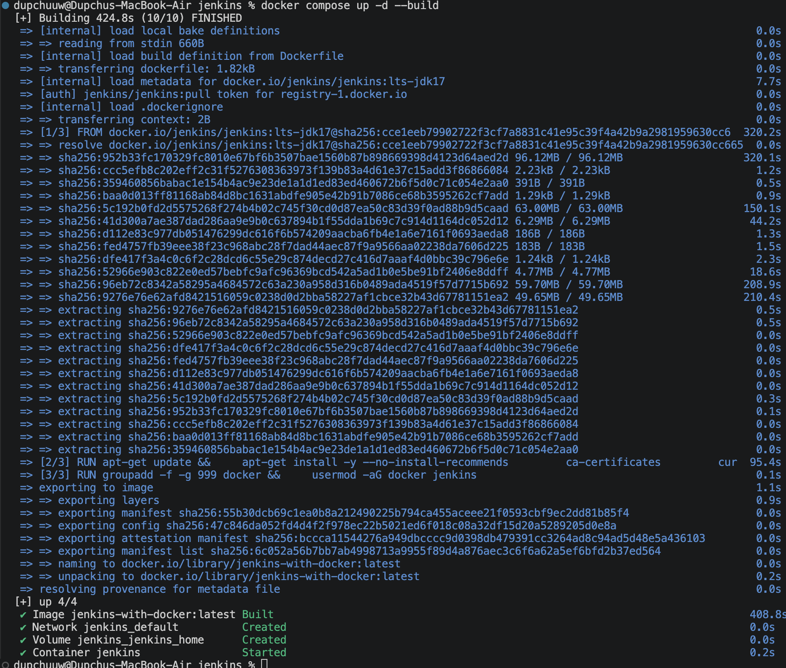
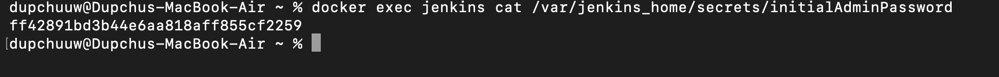
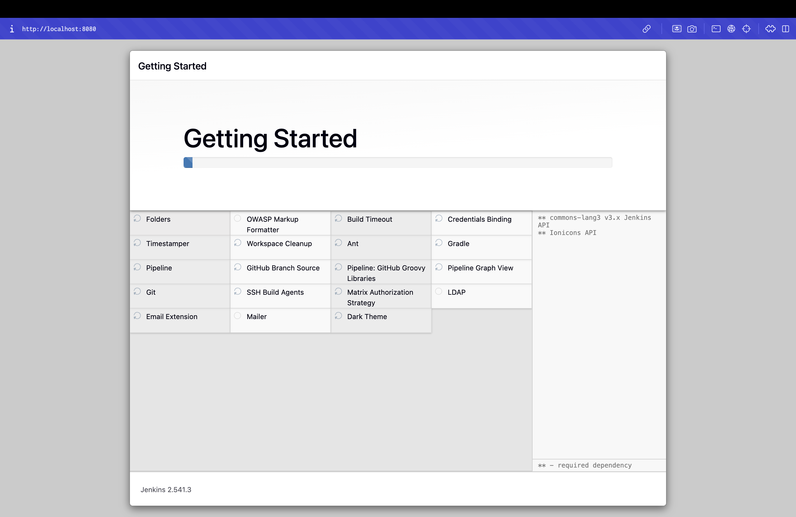
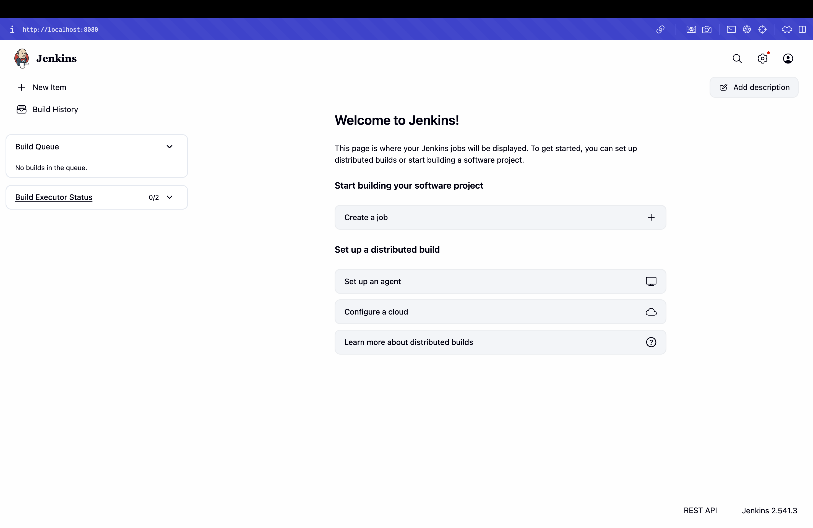
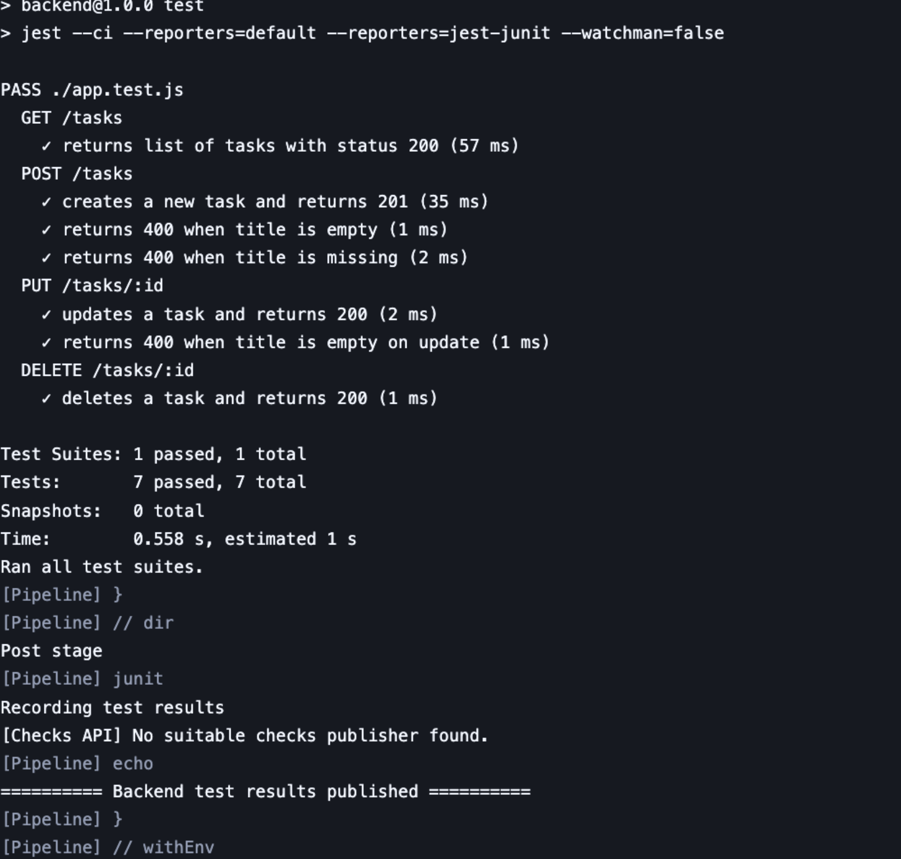
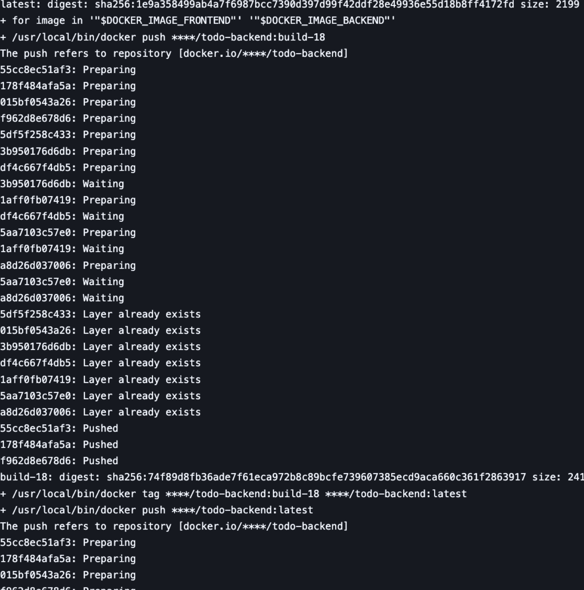
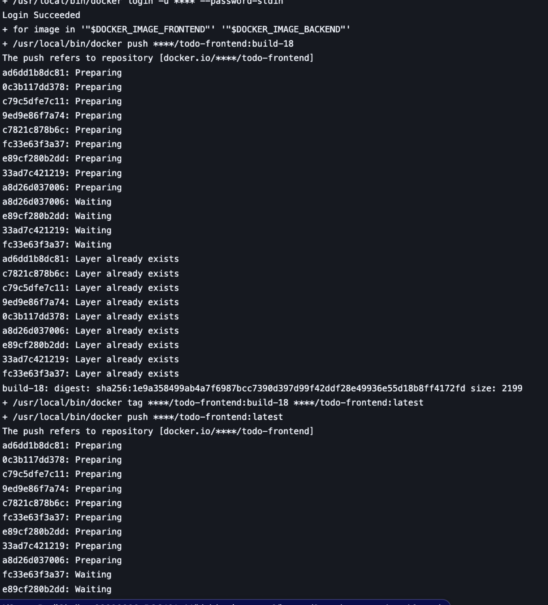
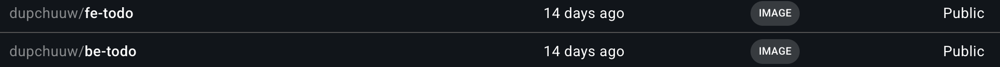

# DSO101 Assignment 2 — Jenkins CI/CD Pipeline
**Student:** Dupchu Wangmo  
**Student ID:** 02230282  
**Module:** DSO101 — Continuous Integration and Continuous Deployment  

## Project Overview

This assignment extends the To-Do List application from Assignment 1 with a Jenkins-based
CI/CD pipeline. Every push to GitHub triggers an automated pipeline that:

1. Checks out the code from GitHub
2. Installs dependencies for both the frontend and backend
3. Builds the React frontend
4. Runs unit tests with Jest and publishes JUnit results to Jenkins
5. Builds Docker images for both services and pushes them to Docker Hub

**Tools used:** Jenkins, GitHub, Node.js 20 LTS, Jest, jest-junit, Docker.


## Repository Structure

```
todo-app/
├── frontend/
│   ├── src/
│   ├── public/
│   ├── Dockerfile
│   ├── nginx.conf
│   └── package.json
├── backend/
│   ├── __tests__/
│   │   └── validation.test.js
│   ├── server.js
│   ├── validation.js
│   ├── Dockerfile
│   └── package.json
├── jenkins/             
│   ├── Dockerfile
│   ├── docker-compose.yml
│   └── README.md
├── render.yaml
├── Jenkinsfile          
└── README.md
```

## Task 1 — Jenkins Setup for Node.js

I chose to run Jenkins as a **Docker container** rather than installing it natively,
to match the Docker-based workflow already used in Assignment 1, and so the entire
Jenkins setup is reproducible from version-controlled files. The setup lives under
the `jenkins/` folder of the repo.

### Step 1.1 — Custom Jenkins image

The official `jenkins/jenkins:lts` image does not include the Docker CLI, but the
pipeline's Deploy stage calls `docker.build` and `docker.withRegistry` - so I built
a small custom image that adds the Docker CLI on top of the official base.

**`jenkins/Dockerfile`** :

```dockerfile
FROM jenkins/jenkins:lts-jdk17
USER root


RUN apt-get update && apt-get install -y --no-install-recommends \
        ca-certificates curl gnupg lsb-release && \
    install -m 0755 -d /etc/apt/keyrings && \
    curl -fsSL https://download.docker.com/linux/debian/gpg | \
        gpg --dearmor -o /etc/apt/keyrings/docker.gpg && \
    echo "deb [arch=$(dpkg --print-architecture) signed-by=/etc/apt/keyrings/docker.gpg] \
        https://download.docker.com/linux/debian $(lsb_release -cs) stable" \
        > /etc/apt/sources.list.d/docker.list && \
    apt-get update && apt-get install -y --no-install-recommends docker-ce-cli

#
ARG DOCKER_GID=999
RUN groupmod -g ${DOCKER_GID} docker && usermod -aG docker jenkins
USER jenkins
```

This installs the **Docker CLI only** — not the Docker daemon. The daemon stays on
the host. The container talks to the host daemon through the Unix socket
`/var/run/docker.sock`, which is bind-mounted in. This pattern is called
**Docker-out-of-Docker (DooD)**, and it's lighter than running a nested daemon
(Docker-in-Docker).

### Step 1.2 — `docker-compose.yml`

```yaml
services:
  jenkins:
    build:
      context: .
      args:
        DOCKER_GID: ${DOCKER_GID:-999}
    image: jenkins-with-docker:latest
    container_name: jenkins
    restart: unless-stopped
    ports:
      - "8080:8080"
    volumes:
      - jenkins_home:/var/jenkins_home              
      - /var/run/docker.sock:/var/run/docker.sock   
volumes:
  jenkins_home:
```

The `jenkins_home` named volume preserves all Jenkins configuration (jobs, plugins,
credentials, build history) across container restarts.

### Step 1.3 — Start Jenkins

From the `jenkins/` folder:

```bash
docker compose up -d --build
```



Once the container was healthy, I retrieved the initial admin password:

```bash
docker exec jenkins cat /var/jenkins_home/secrets/initialAdminPassword
```


Password: ff42891bd3b44e6aa818aff855cf2259

Then opened `http://localhost:8080`, pasted the password, picked **Install
suggested plugins**, and created an admin user.





### Step 1.4 — Install Required Plugins

After the setup wizard, went to **Manage Jenkins → Plugins → Available** and
installed the plugins not included in "suggested":

- **NodeJS Plugin** — provides `npm` inside the pipeline
- **Docker Pipeline** — provides the `docker.build` / `docker.withRegistry` DSL used
  in the Deploy stage

(Pipeline, GitHub Integration, JUnit, Git, and Credentials are all included by
the "suggested plugins" option during setup.)


### Step 1.5 — Configure Node.js in Jenkins

Went to **Manage Jenkins → Tools → NodeJS installations** and added:

| Field | Value |
|-------|-------|
| Name  | `NodeJS` (must match `tools { nodejs 'NodeJS' }` in the Jenkinsfile) |
| Version | `NodeJS 20.x LTS` |
| Install automatically | ✓ |


## Task 2 — GitHub Repository Setup

### Step 2.1 — Generate a GitHub Personal Access Token (PAT)

GitHub → **Settings → Developer Settings → Personal Access Tokens → Tokens (classic)**.
Created a token with the `repo` and `admin:repo_hook` scopes and copied the value once
(GitHub never shows it again).

### Step 2.2 — Add GitHub Credentials in Jenkins

**Manage Jenkins → Credentials → System → Global credentials → Add Credentials**:

| Field | Value |
|-------|-------|
| Kind | Username with password |
| Username | `Dupchuwangmo7` |
| Password | (the PAT generated above) |
| ID | `github-creds` |

The same `github-creds` ID is referenced in the `Jenkinsfile` checkout stage.

### Step 2.3 — Add Docker Hub Credentials in Jenkins

Created a Docker Hub access token at **Docker Hub → Account Settings → Security → New
Access Token**, then added another credential in Jenkins:

| Field | Value |
|-------|-------|
| Kind | Username with password |
| Username | `dupchuuw` |
| Password | (Docker Hub access token) |
| ID | `docker-hub-creds` |


## Task 3 — Jenkinsfile

The full Jenkinsfile lives at the repo root. Key design notes:

- The project is a **monorepo** (frontend + backend), so `dir('backend')` and
  `dir('frontend')` are used to scope each command to the right folder. The example in the
  assignment PDF assumes a single Node.js project at the repo root.
- **Install Dependencies** runs frontend and backend `npm install` in **parallel** to
  reduce build time.
- **Test** runs only on the backend. `jest-junit` writes `junit.xml` to `backend/`, which
  the `junit` step then publishes to Jenkins.
- **Docker Build & Push** uses the `docker-pipeline` plugin's DSL to authenticate with
  Docker Hub via the stored `docker-hub-creds` credential — no plaintext passwords in the
  pipeline.

### Full Jenkinsfile

```groovy
pipeline {
    agent any

    tools {
        nodejs 'NodeJS'
    }

    environment {
        DOCKER_HUB_USER = 'dupchuuw'
        STUDENT_ID      = '02230282'
    }

    stages {
        stage('Checkout') {
            steps {
                git branch: 'main',
                    url: 'https://github.com/Dupchuwangmo7/Dupchuwangmo7_02230282_DSO101_A1.git',
                    credentialsId: 'github-creds'
            }
        }

        stage('Install Dependencies') {
            parallel {
                stage('Backend npm install') {
                    steps { dir('backend')  { sh 'npm install' } }
                }
                stage('Frontend npm install') {
                    steps { dir('frontend') { sh 'npm install' } }
                }
            }
        }

        stage('Build Frontend') {
            steps { dir('frontend') { sh 'CI=false npm run build' } }
        }

        stage('Test') {
            steps { dir('backend') { sh 'npm test' } }
            post {
                always { junit 'backend/junit.xml' }
            }
        }

        stage('Docker Build & Push') {
            steps {
                script {
                    docker.withRegistry('https://registry.hub.docker.com', 'docker-hub-creds') {
                        def beImage = docker.build("${DOCKER_HUB_USER}/be-todo:${STUDENT_ID}", "./backend")
                        beImage.push()
                        beImage.push('latest')

                        def feImage = docker.build("${DOCKER_HUB_USER}/fe-todo:${STUDENT_ID}", "./frontend")
                        feImage.push()
                        feImage.push('latest')
                    }
                }
            }
        }
    }

    post {
        success { echo "Pipeline succeeded — images pushed to Docker Hub." }
        failure { echo 'Pipeline failed — see stage logs above.' }
        always  { cleanWs() }
    }
}
```

### Backend test setup

`backend/package.json` was extended with the test script and dev dependencies:

```json
{
  "scripts": {
    "test": "jest --ci --reporters=default --reporters=jest-junit"
  },
  "devDependencies": {
    "jest": "^29.7.0",
    "jest-junit": "^16.0.0"
  },
  "jest-junit": {
    "outputDirectory": ".",
    "outputName": "junit.xml"
  }
}
```



A small pure-function module `backend/validation.js` provides input-validation helpers
(`isValidTitle`, `normalizeTitle`, `parseId`). Eleven Jest test cases live in
`backend/__tests__/validation.test.js` and run without needing a database connection — so
the pipeline is fast and deterministic.


## Task 4 — Run the Pipeline

### Step 4.1 — Create the Pipeline Job in Jenkins

**Jenkins → New Item → Pipeline**, named `dso101-todo-pipeline`. Configuration:

| Field | Value |
|-------|-------|
| Definition | Pipeline script from SCM |
| SCM | Git |
| Repository URL | `https://github.com/Dupchuwangmo7/Dupchuwangmo7_02230282_DSO101_A1.git` |
| Credentials | `github-creds` |
| Branch | `*/main` |
| Script Path | `Jenkinsfile` |

Saved and clicked **Build Now**.


### Step 4.2 — Successful Pipeline Run

For Backend



For frontend



### Step 4.3 — Test Results in Jenkins


### Step 4.4 — Docker Hub



# Conclusion

In this assignment, I successfully implemented a full CI/CD pipeline for my full-stack To-Do List application using Jenkins, GitHub, Docker, automated testing, and local container deployment. The pipeline checks out the source code from the assignment-2 branch, installs frontend and backend dependencies, builds the React application, runs automated frontend and backend tests, publishes JUnit test results, builds Docker images, pushes them to Docker Hub, and deploys both services as running containers.

Through this work, I demonstrated practical understanding of Continuous Integration and Continuous Deployment concepts rather than only describing them theoretically. I also learned how to diagnose and solve real pipeline issues such as Jenkins configuration problems, Docker permission errors, interactive test behavior, and test dependency isolation. Overall, this assignment strengthened my understanding of how modern software delivery pipelines are built and why automation is essential for reliability, repeatability, and professional software engineering practice.

