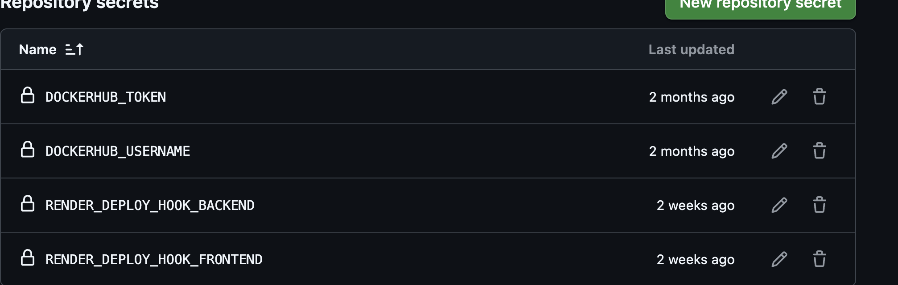
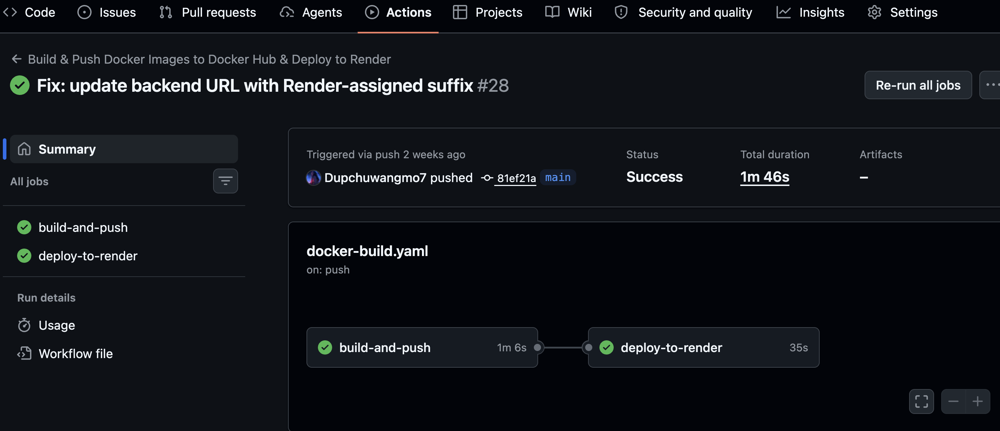
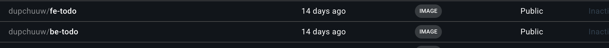
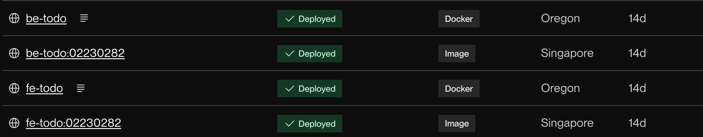

# Assignment 3: CI/CD with GitHub Actions, Docker, and Render.com


## Overview

This report documents the setup and deployment of a CI/CD pipeline for a Node.js To-Do List application. The pipeline automates building a Docker image, pushing it to DockerHub, and deploying it to Render.com — all triggered by a push to the `main` branch on GitHub.


## Tools & Technologies Used

| Tool | Purpose |
|---|---|
| GitHub | Source code hosting |
| GitHub Actions | CI/CD automation |
| Docker | Containerization |
| DockerHub | Container image registry |
| Render.com | Cloud deployment platform |
| Node.js & npm | Backend runtime and package management |


## Steps Taken

### Task 1 – GitHub Repository Setup

1. Verified that the GitHub repository was set to **public**.
2. Confirmed `package.json` contained the required scripts:
   - `"start"` – to run the application
   - `"test"` – to execute the test suite

### Task 2 – Dockerizing the Application

1. Created a `Dockerfile` in the root of the repository with the following configuration:
   - Base image: `node:20-alpine` (lightweight Node.js LTS)
   - Working directory set to `/app`
   - Dependencies installed via `npm install`
   - Application source copied into the container
   - Port `3000` exposed
   - Application started with `npm start`

2. Built and tested the Docker image locally to confirm the application ran correctly inside the container:
   ```bash
   docker build -t todo-app .
   docker run -p 3000:3000 todo-app
   ```

### Task 3 – GitHub Actions Workflow

1. Created the file `.github/workflows/deploy.yml` to define the CI/CD pipeline.
2. The workflow is triggered on every push to the `main` branch and performs four steps:
   - **Checkout** – pulls the latest code using `actions/checkout@v4`
   - **DockerHub Login** – authenticates using `docker/login-action@v3` with stored secrets
   - **Build & Push** – builds the Docker image and pushes it to DockerHub
   - **Render Deployment** – triggers a redeployment on Render.com via its deploy webhook URL

3. Added the following **GitHub Secrets** to the repository (no credentials were hardcoded):
   - `DOCKERHUB_USERNAME` – DockerHub account username
   - `DOCKERHUB_TOKEN` – DockerHub access token
   - `BACKEND_DEPLOY_HOOK_URL` – Render.com deploy webhook URL
   - `FRONTEND_DEPLOY_HOOK_URL` – Render.com deploy webhook URL




## Challenges Faced

The implementation proceeded smoothly without any major blockers. 

- The Dockerfile built cleanly with no dependency errors.
- GitHub Secrets were configured correctly, and the Actions workflow authenticated to DockerHub without issues.
- The Render webhook integration worked as expected, triggering an automatic redeployment each time a new image was pushed.


## Learning Outcomes

1. **CI/CD Fundamentals** – Gained hands-on experience building a complete CI/CD pipeline from source code to live deployment, understanding how each stage (build → test → push → deploy) connects.

2. **Docker & Containerisation** – Learned how to write a production-ready `Dockerfile`, build images locally, and push them to a container registry (DockerHub).

3. **GitHub Actions** – Understood how to define workflows using YAML, use community actions (`actions/checkout`, `docker/login-action`), and securely inject credentials using GitHub Secrets.

4. **Secrets Management** – Practised the principle of never hardcoding credentials, instead using repository-level secrets referenced in workflow files.

5. **Cloud Deployment with Render.com** – Learned how to deploy a containerised application from DockerHub to a cloud hosting platform and automate redeployment using webhook triggers.

6. **End-to-End Automation** – Appreciated how every `git push` to `main` now automatically builds, packages, and deploys the application with zero manual intervention.


## Screenshots

### 1. Successful GitHub Actions Workflow



### 2. Docker Image Pushed to DockerHub


### 3. Render.com Live Deployment


## Live Deployment

🔗 **Render Deployment URL:** [https://fe-todo-02230282.onrender.com](https://your-app.onrender.com)  
🔗 **GitHub Repository:** [https://github.com/Dupchuwangmo7/SS2026_DSO101_Assignment1](https://github.com/your-username/your-repo)

